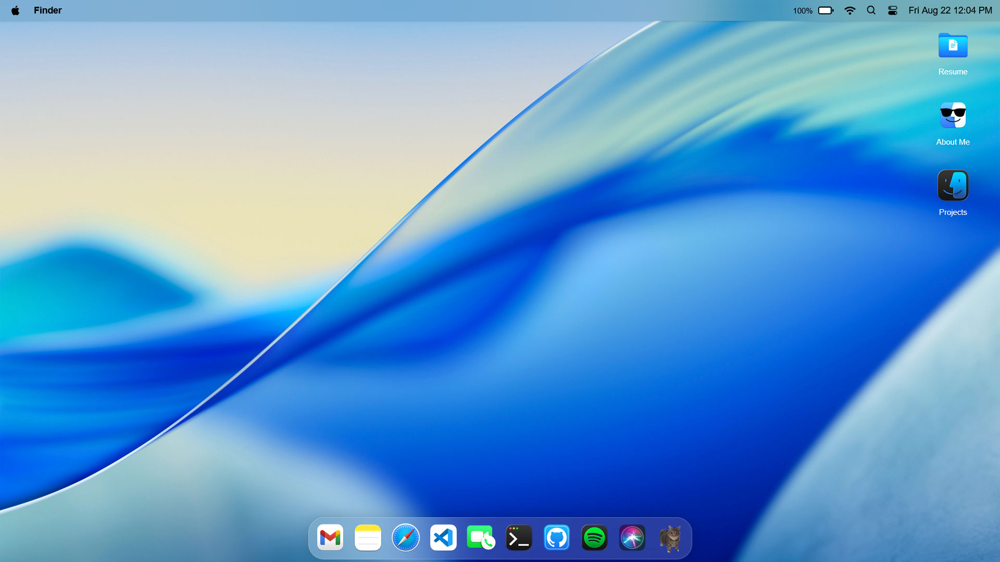
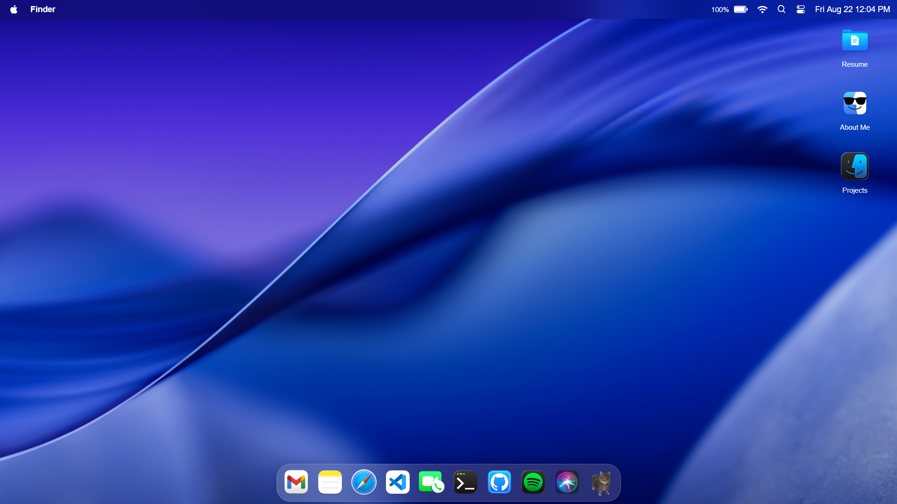

# macOS Portfolio

A macOS-style portfolio website built with React, TypeScript, and Vite. This interactive portfolio mimics the macOS interface with draggable windows, a dock, and various applications.

## 🌟 Screenshots

| Light Mode | Dark Mode |
|------------|-----------|
|  |  |

## 🚀 Features

- 🖥️ macOS-like desktop interface
- 🎨 Multiple interactive applications
- ✍️ Markdown editor with Milkdown
- 🤖 AI integration with Google Generative AI
- 📝 Rich text editing capabilities
- 🎨 Customizable UI with themes
- 📱 Responsive design

## 🛠️ Prerequisites

- Node.js (v16 or later)
- pnpm (recommended) or npm
- Git

## 🚀 Quick Start

1. **Clone the repository**
   ```bash
   git clone https://github.com/sahxzm/MacOS-Portfolio.git
   cd MacOS-Portfolio
   ```

2. **Install dependencies**
   ```bash
   pnpm install
   # or
   npm install
   ```

3. **Start the development server**
   ```bash
   pnpm dev
   # or
   npm run dev
   ```
   This will start the development server at `http://localhost:5173`

4. **Build for production**
   ```bash
   pnpm build
   pnpm serve  # To preview the production build
   ```

## 📂 Project Structure

- `/src/components` - Reusable UI components
- `/src/configs` - Application configurations
- `/src/pages` - Main application pages
- `/src/stores` - State management with Zustand
- `/src/styles` - Global styles and themes
- `/public` - Static assets

## 🌟 Key Applications

- **Finder**: Navigate through the portfolio
- **Notes**: Rich text editor with markdown support
- **Terminal**: Interactive command line interface
- **Mail**: Contact form with email functionality
- **Siri-AIChat**: Chat with AI using Google's Generative AI

## 🔧 Configuration

Create a `.env` file in the root directory with the following variables:

```env
VITE_EMAILJS_SERVICE_ID=your_service_id
VITE_EMAILJS_TEMPLATE_ID=your_template_id
VITE_EMAILJS_PUBLIC_KEY=your_public_key
VITE-GEMINI_AI_KEY=your_gemini_api_key
```

## 🤝 Contributing

1. Fork the repository
2. Create a new branch
3. Make your changes
4. Submit a pull request
